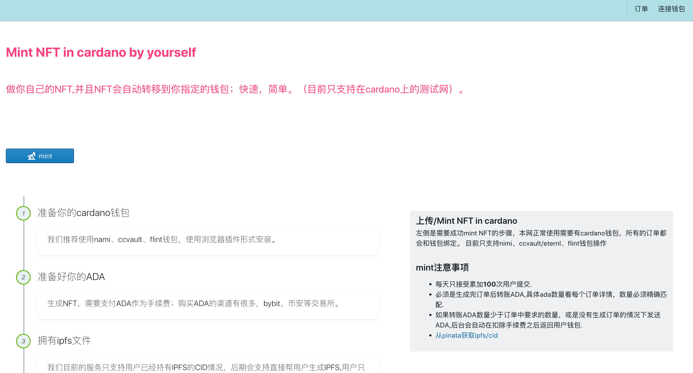
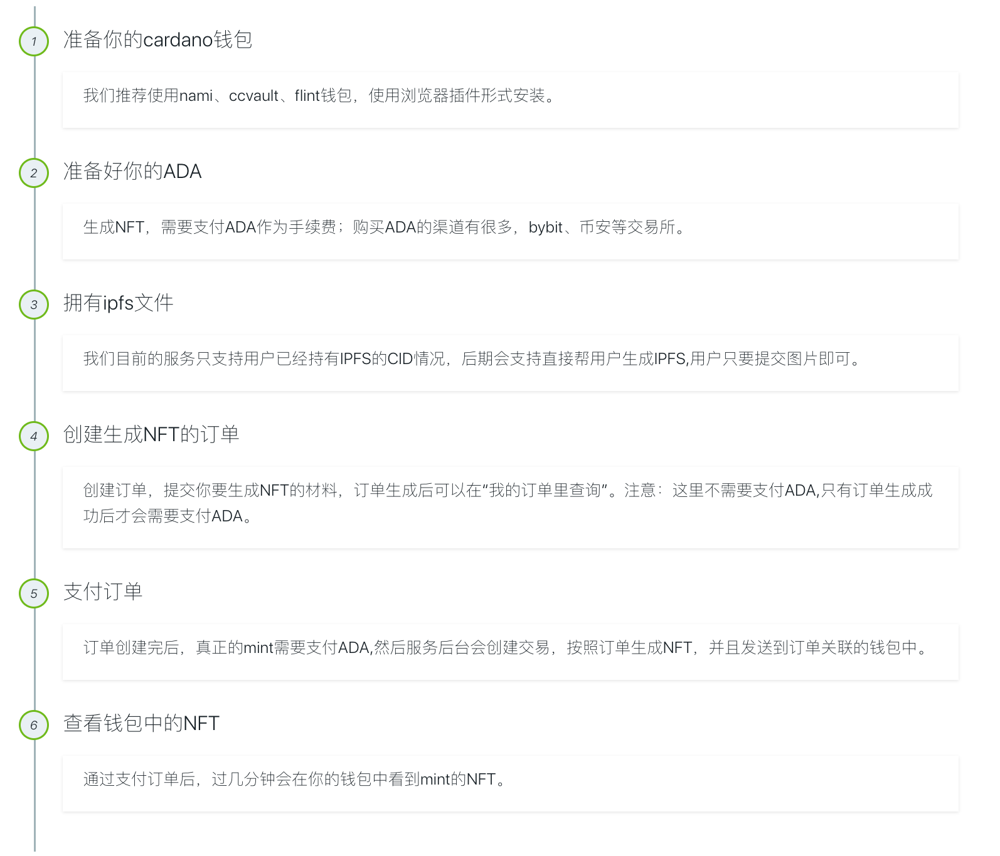
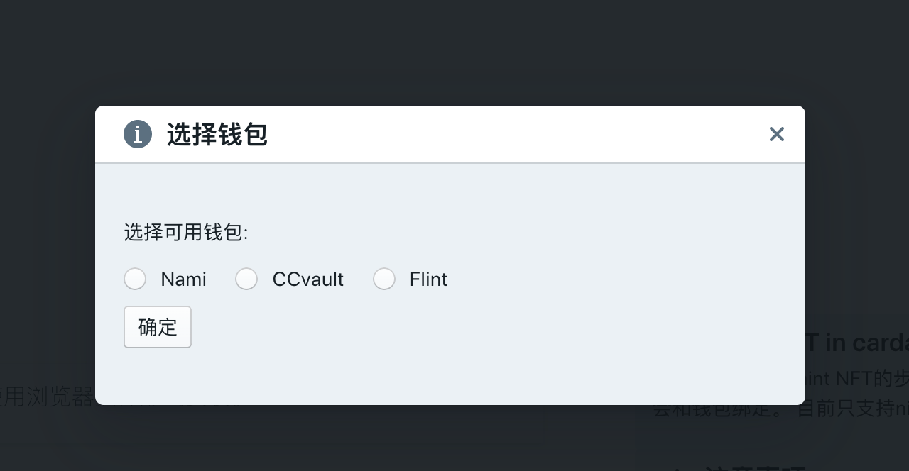
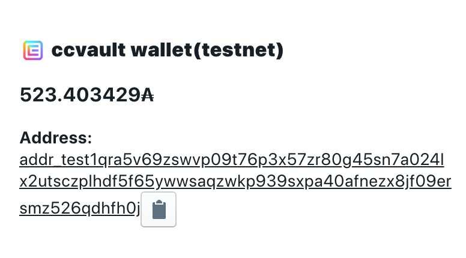
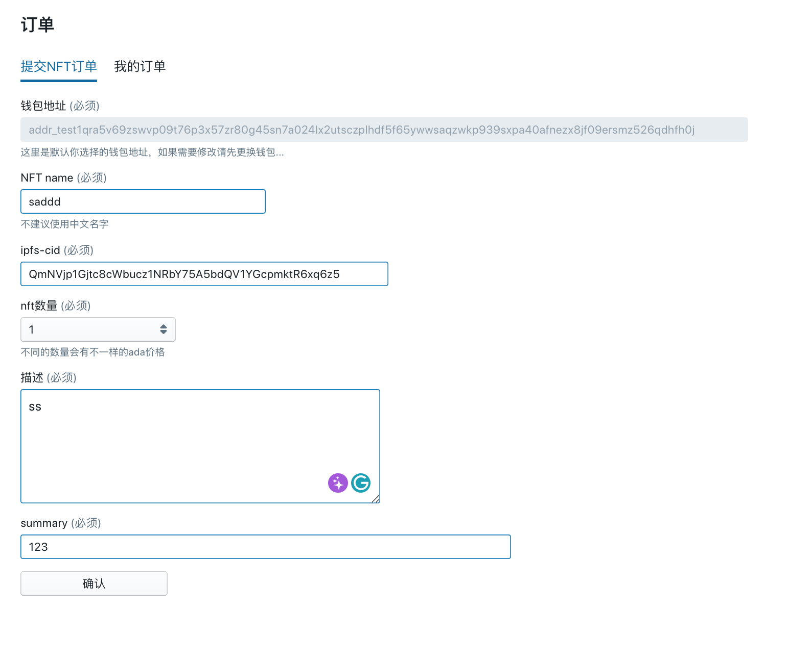
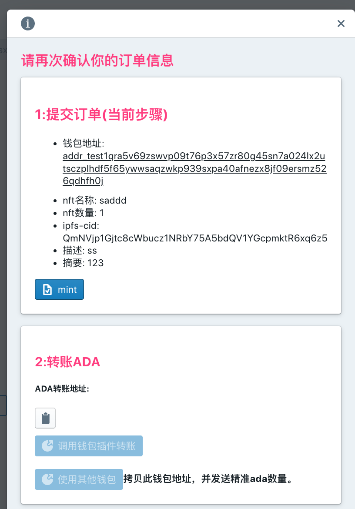
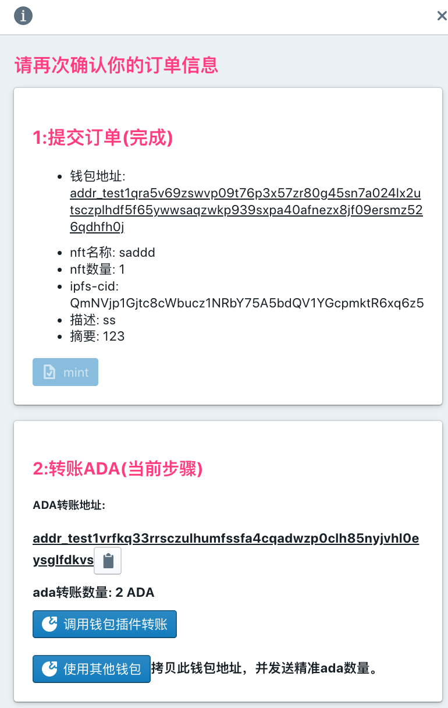
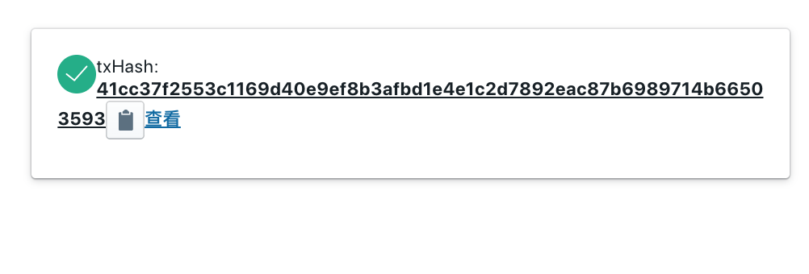

# web asset mint

### 功能介绍
#  

项目主要是用react来实现，功能是在页面调用nami/eternl/flint插件（推荐chrome）, 得到用户的钱包地址后，用户再输入一些mint必须的参数，例如name ,ipfs, 数量等信息，提交到后台，就是项目[api-asset-mint](https://github.com/malakaw/web-asset-mint.git).

项目启动的时候记如果有内存不够用的异常，建议使用一下命令

```
export NODE_OPTIONS=--max-old-space-size=8192
```


第一次启动项目前记得

```
npm install
```


#### 截图介绍


首页




操作步骤介绍



最后一步检查是否支付代码还没有补上，目前为了测试所有提交都可以生产nft

选择钱包




钱包信息




mint表单提交字段



确认后，准备提交




提交




成功后显示tx-hash



ok,完成。
